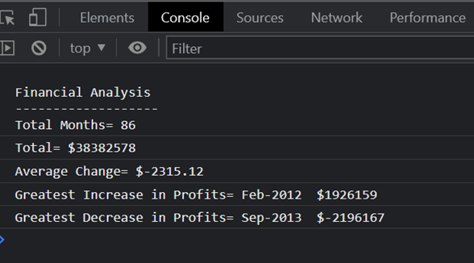

# Console-Finances
Created a financial analysis tool for a company

## Description
By using Javascript I analyzed the company's records to calculate each of the following:

The total numbers of months included in the dataset.
The net total amount of Profit/Losses over the entire period.
The average of the changes in Profit/Losses over the entire period.
The greatest increase in profits (date and amount) over the entire period.
The greatest decrease in losses (date and amount) over the entire period.

## Installation
N/A

## Usage
Deployed application: https://elentis.github.io/Console-Finances/ 

Open the html file and inspect the console. 
The console shows the following information:

## Credits
N/A

## License
Please refer to the LICENSE in the repo
